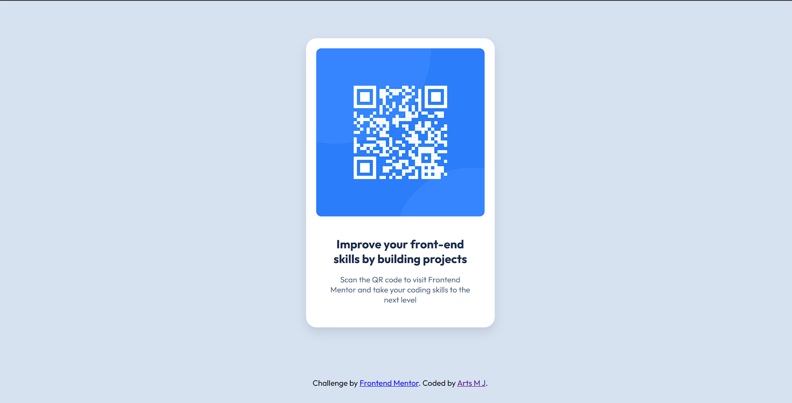

# Frontend Mentor - QR Code Component



A responsive QR code component solution for Frontend Mentor challenge. Built with semantic HTML and modern CSS techniques.

[](https://yourusername.github.io/fm-qr-code-component)
[](https://www.frontendmentor.io/challenges/qr-code-component-iux_sIO_H)

## Table of Contents

- [Features](#features)
- [Built With](#built-with)
- [What I Learned](#what-i-learned)
- [Live Demo](#live-demo)
- [Author](#author)

## Features

- ✅ Mobile-first responsive design
- ✅ Pixel-perfect implementation
- ✅ Semantic HTML5 markup
- ✅ CSS custom properties
- ✅ Accessibility best practices
- ✅ Cross-browser compatibility

## Built With

[](https://skillicons.dev)

- Semantic HTML5
- CSS3 (Flexbox, Variables)
- Mobile-first workflow
- Outfit Google Font

## What I Learned

### CSS Variables Implementation

```css
:root {
  --white: hsl(0, 0%, 100%);
  --light-gray: hsl(212, 45%, 89%);
  --grayish-blue: hsl(220, 15%, 55%);
  --dark-blue: hsl(218, 44%, 22%);
}

## Author

- Frontend Mentor - [@yourusername](https://www.frontendmentor.io/profile/yourusername)
- Twitter - [@yourusername](https://www.twitter.com/yourusername)

```
